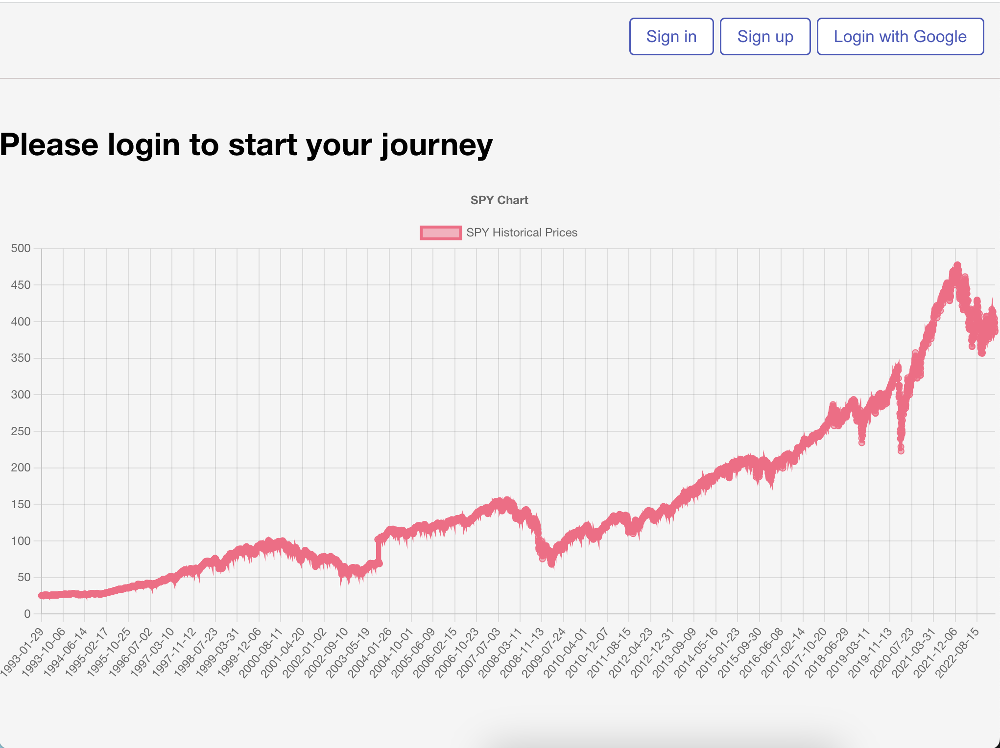
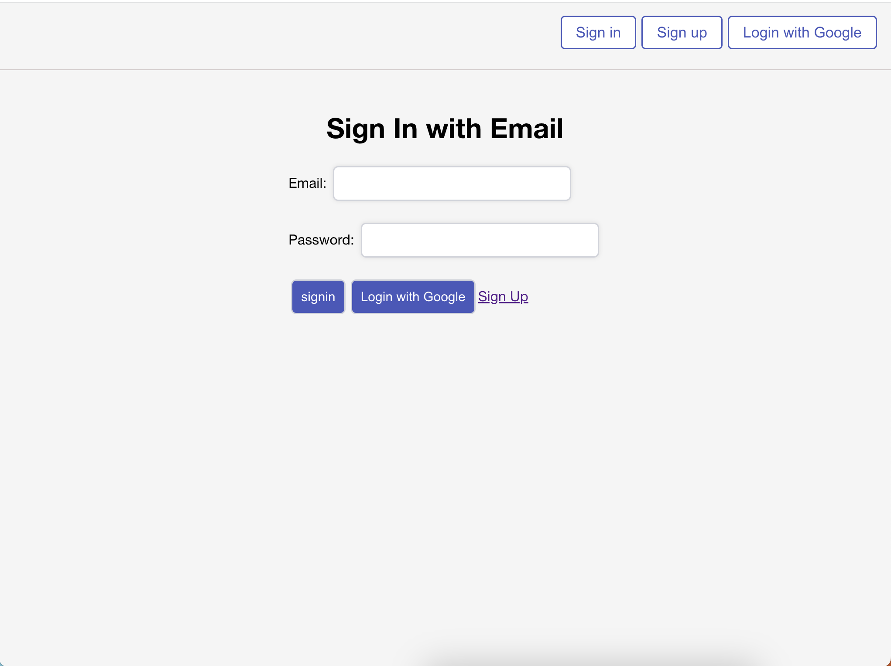

# Invest-App

### A web application that allows users to practice trading and investing in stocks. Users can also add comments to an individual stock to provided information to other users on stock performance. Please note stock values are currently updated once per day at 4 PM EST.

## Technologies Used

1. React
2. Node.js
3. Mongoose
4. MongoDb
5. JavaScript
6. CSS3
7. Express
8. Bootstrap
9. Firebase
10. Heroku
11. Netlify 
12. Stock API 

## Application Screenshots

## Getting Started

* Create an account or login to access the site.

Click here to visit site.....[LINK](https://thunderous-cactus-ea99a9.netlify.app/)

# Future Enhancements 
 * Display updated stock information in real time
 * Add a news feed section specific to the stock a user is viewing
 * Add charts for each stock
 